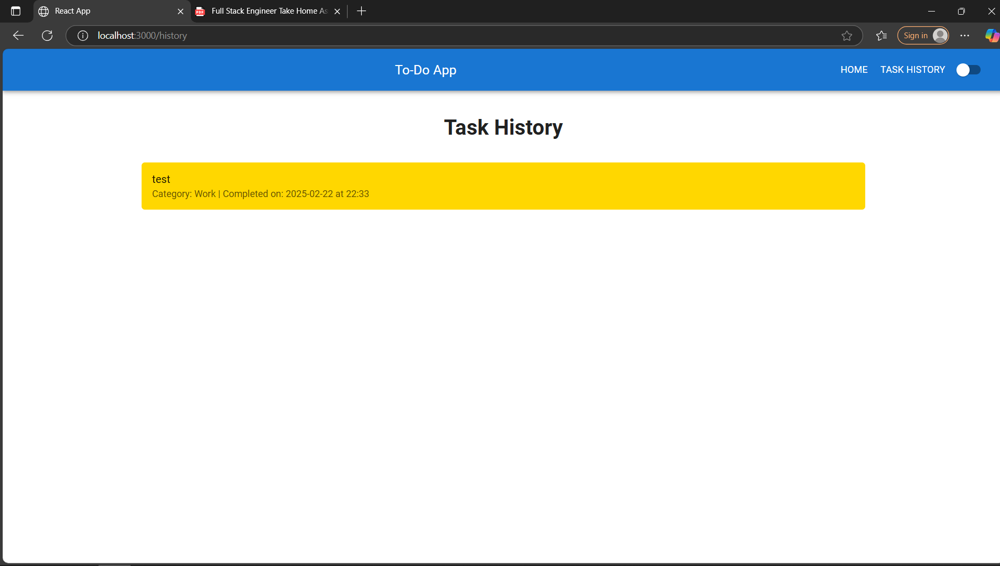
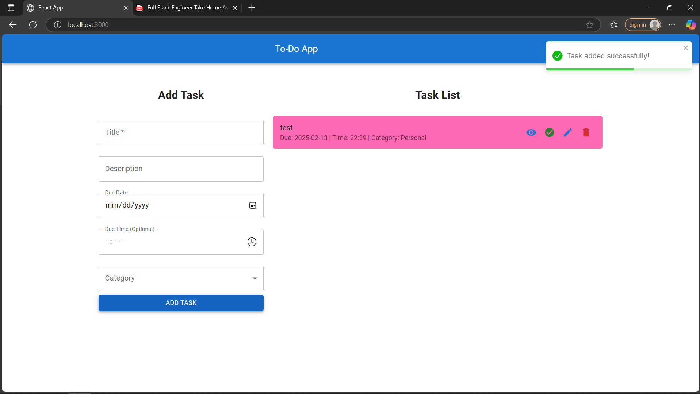
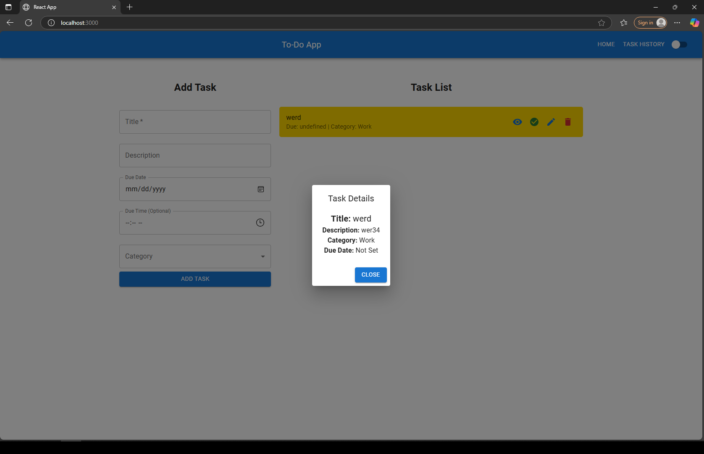
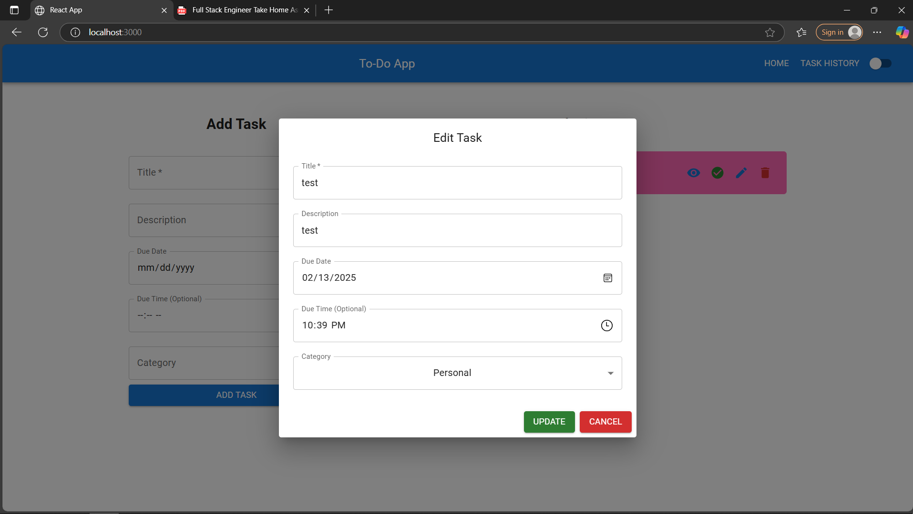

# **Frontend - Full Stack To-Do App** 📝



This is the **React.js** frontend for the **Full Stack To-Do App**. It provides a user-friendly interface to **add, update, delete, and complete tasks**, with **category-based styling, dark mode, and task history**.

---

## **Features** ✨

### ✅ **Task Management**
- Add **new tasks** with **title, description, due date, and due time**.
- View all tasks in a **side-by-side layout** for easy management.
- **Edit** existing tasks with an intuitive modal.
- **Delete** tasks with a confirmation prompt.
- **Mark tasks as completed** with a visible **done button**.

### 🎨 **UI Enhancements**
- **Category-based colors**:
  - **Personal** → **Pink**
  - **Work** → **Yellow**
  - **Urgent** → **Red**
- **Dark Mode Toggle** using **Material UI**.
- **Toast notifications** for all actions (Task Added, Updated, Deleted, Completed).
- **Task Details Modal** for viewing tasks.

### 🕒 **Date & Time Support**
- Tasks can be assigned a **due date** and an **optional due time**.
- Completed tasks store a **"Finished Date & Time"**.

### 📜 **Task History**
- Displays **completed tasks** with their **category, finished date & time**.
- Uses **category colors** for easy recognition.

### 🔄 **Drag & Drop Reordering**
- Users can reorder tasks using **React DnD**.

---

## **Project Setup** ⚙️

### **1️⃣ Install Dependencies**
```sh
npm install
```

### **2️⃣ Start the React App**
```sh
npm start
```
The app will be available at:  
**`http://localhost:3000`**

### **3️⃣ Environment Variables**
Create a **`.env`** file and set the backend API URL:
```sh
REACT_APP_API_URL=http://localhost:5000
```

---

## **API Endpoints Used** 📡

- `GET /tasks` → Fetch all tasks
- `POST /tasks` → Add a new task
- `PUT /tasks/:id` → Update a task
- `DELETE /tasks/:id` → Delete a task
- `PATCH /tasks/:id/done` → Mark task as completed
- `GET /tasks/completed` → Fetch completed tasks

---

## **Technologies Used** 🛠️

- **React.js** (Frontend Framework)
- **Material UI** (UI Components)
- **Axios** (API Requests)
- **React Router** (Navigation)
- **React DnD** (Drag & Drop for task reordering)
- **Context API** (State Management)
- **React Toastify** (Notifications)

---

## **Screenshots** 📸

✅ **Task List (With Category Colors & Side-by-Side Layout)**  

✅ **Task Details Modal**  

✅ **Edit Task Modal**  

✅ **Task History Page (Completed Tasks)**  

